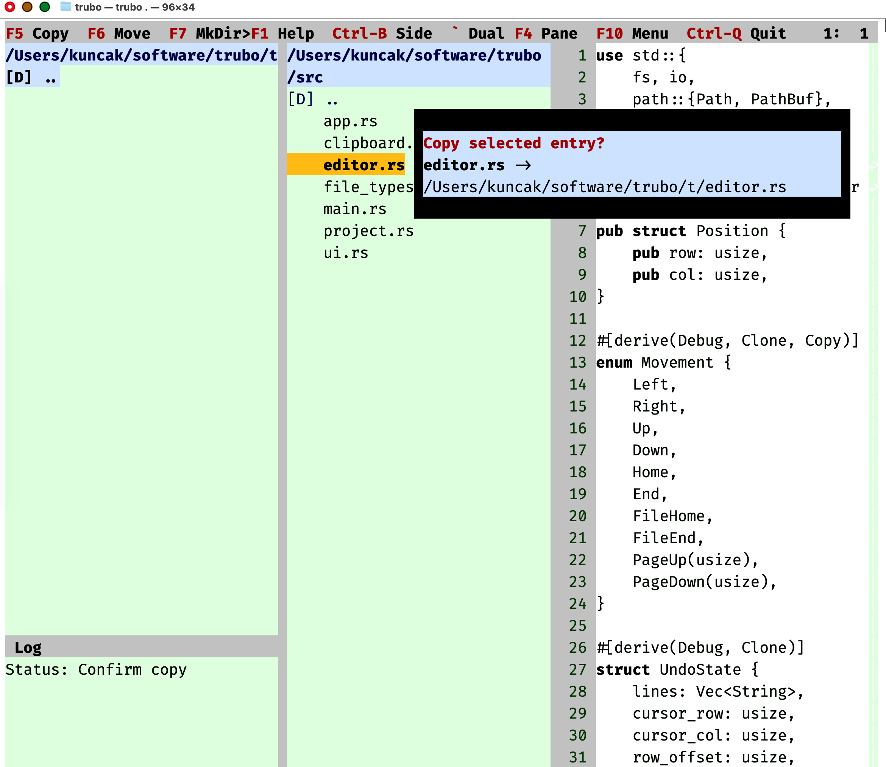

# trubo

Text (Rust, Unicode, Basic) Operator

trubo is an EXPERIMENTAL retro TUI text editor and file manager in Rust. 

It's originally based on TRUST ( https://github.com/wojtczyk/trust ) from which this was forked.

In the meantime, it was extended step by step using guidance by Viktor Kuncak and using LLMs, primarily GPT 5.4.

See [CONTRIBUTORS](CONTRIBUTORS) for the current contributor list.

Highlights:

  * Name changed to "trubo"
  * Dual pane with file operations and preview
  * Space-saving editor-only mode
  * Style using more colors and less boundary boxes
  * Editor supporting undo, regex search, keyword highlighting

## Run

```sh
cargo run -- /path/to/file-or-directory
```
If no path is supplied, trubo opens the current directory. If a file path is
supplied, trubo opens that file directly and uses its parent directory for the
browser pane.

## Documentation

User-facing usage is documented in [doc/GUIDE.md](doc/GUIDE.md).

Architecture and module structure are documented in [doc/ARCHITECTURE.md](doc/ARCHITECTURE.md).

That documentation is the source of truth for:

- operating modes: editor-only, single-pane, dual-pane
- current keyboard and mouse controls
- browser file operations
- the (rudimentary!) run/build behavior 
- editor features and limitations

## Quick Start

The most important keys are:

- `F1`: in-app help
- `Ctrl+Q`: quit the editor
- `Ctrl+B`: toggle editor-only mode
- `` ` ``: toggle dual-pane mode
- `F4` or `Tab`: cycle pane focus
- `F2` or `Ctrl+S`: save
- `Ctrl+F`: regex search

For the full guide, see [doc/GUIDE.md](doc/GUIDE.md).

## Screenshot





## Notes

Only one file can be edited at a time.

File backups are saved using the `~` suffix.

The file pane lists directories and all regular files. trubo opens files as
lossy text regardless of extension.

